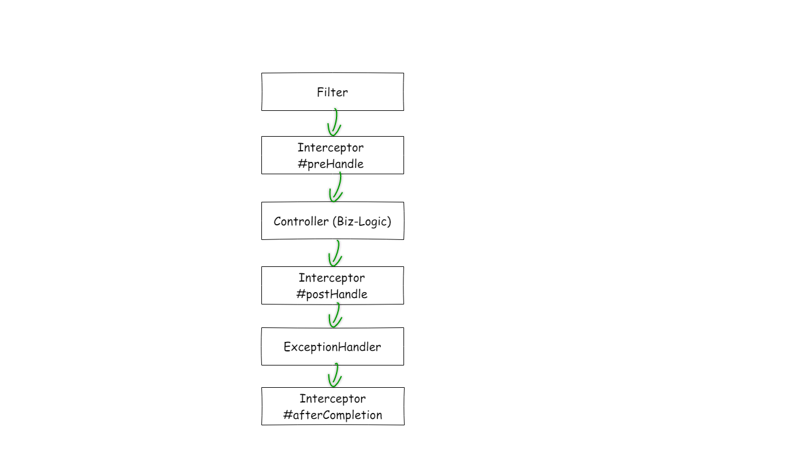

# 全链路异步

当前`Restlight`版本支持`Filter` ， `HandlerInterceptor`, `Controller`,  `ExceptionHandler`异步。

对应处理链路



上述对应着一个请求的完成执行链路， 并且每个链路都支持异步。


## `CompletableFuture`使用注意

- `CompletableFuture`中**不带**`xxxAsync(xxx)`的方法默认会在当前线程执行(当前线程指的是调用`CompletableFuture.complete(xxx)`或者`CompletableFuture.completeExceptionally(xxx)`的线程)， 因此此种方式`CompletableFuture`的线程执行策略为尽量不切换线程（这里的尽量并不是完全一定， 因为如果当前future已经为完成的状态那么`CompletableFuture`会直接执行后续逻辑）
- `CompletableFuture`中**带**`xxxAsync(xxx)`的方法要求传入一个`Executor`， 后续回掉逻辑将在这个`Executor`中执行。 默认不传的情况下会使用`ForkJoinPool`中的公共线程池。 因此应当对所有的`xxxAsync(xxx)`方法调用格外注意， 一旦使用了错误的线程池可能导致隔离性的缺失， 性能不符合预期等问题。

## Restlight 异步保证

- **`Restlight`保证在框架层面对所有的`CompletableFuture`处理都不会主动的切换执行的线程**。


这个保证使得用户无需担心不知道自己的代码将会在什么线程上执行。

```tip
上面的保证意味着如果用字自己切换了执行的线程（通常异步可能都会做这个动作）， 那么这个节点以后的所有代码都将在切换后的线程上执行， 而不是在`Restlight`的业务线程池。
```

**例**

用户在`HandlerInterceptor`中写下了如下代码

```java
private final Executor customExecutor = ...;
            
@Override
public CompletableFuture<Boolean> preHandle0(AsyncRequest request,
                                             AsyncResponse response,
                                             Object handler) {
    // 线程切换到 customExecutor并回调Restlight
    return CompletableFuture.supplyAsync(() -> {
        // ....
        return true;
    }, customExecutor);
}
```

其中当执行`HandlerInterceptor.preHandle(xxx)`时用户使用了自定义的线程池作为异步实现，并在完成操作后回调`Restlight`， 后续所有`Controller`, `ExceptionHandler`等操作都将在`customExecutor`的线程上执行（除非用户主动切换）


下面的`Controller`将会在`customExecutor`的线程上被调用， 而不是业务线程池

```java
@GetMapping(value = "/test")
public String foo() {
    // biz logic
    return "Hello Restlight!";
}
```

如果需要回到业务线程池执行则需要用户自行通过`CompletableFuture`进行操作

```java
@GetMapping(value = "/test")
public CompletableFuture<String> foo() {
    // 回到业务线程池执行Controller逻辑
    return CompletableFuture.supplyAsync(() -> {
        // biz logic
        return  "Hello Restlight!";
    }, bizExecutor);
}
```

