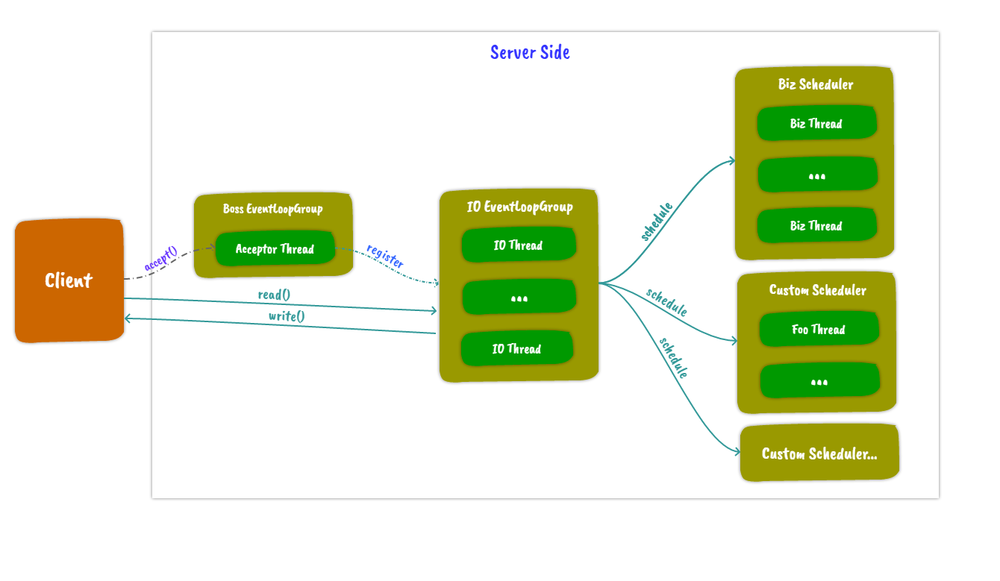

# Threading Model

## `Restlight`线程模型

如果熟悉Java的IO模型，那大多了解过Doug Lea的[《Scalable IO in Java》](http://gee.cs.oswego.edu/dl/cpjslides/nio.pdf), 而Restlight则是类似模型的实现。

### 线程模型



`Restlight`由于是使用`Netty`作为底层HttpServer的实现，因此图中沿用了部分`EventLoop`的概念，线程模型由了`Acceptor`，`IO EventLoopGroup`（IO线程池）以及`Biz ThreadPool`（业务线程池）组成。

- `Acceptor`： 由1个线程组成的线程池， 负责监听本地端口并分发IO 事件。
- `IO EventLoopGroup`： 由多个线程组成，负责读写IO数据(对应图中的`read()`和`write()`)以及HTTP协议的编解码和分发到业务线程池的工作。
- `Biz Scheduler`：负责执行真正的业务逻辑（大多为Controller中的业务处理，拦截器等）。
- `Custom Scheduler`: 自定义线程池

```tip
通过第三个线程池`Biz Scheduler`的加入完成IO操作与实际业务操作的异步（同时可通过Restlight的线程调度功能随意调度）
```
